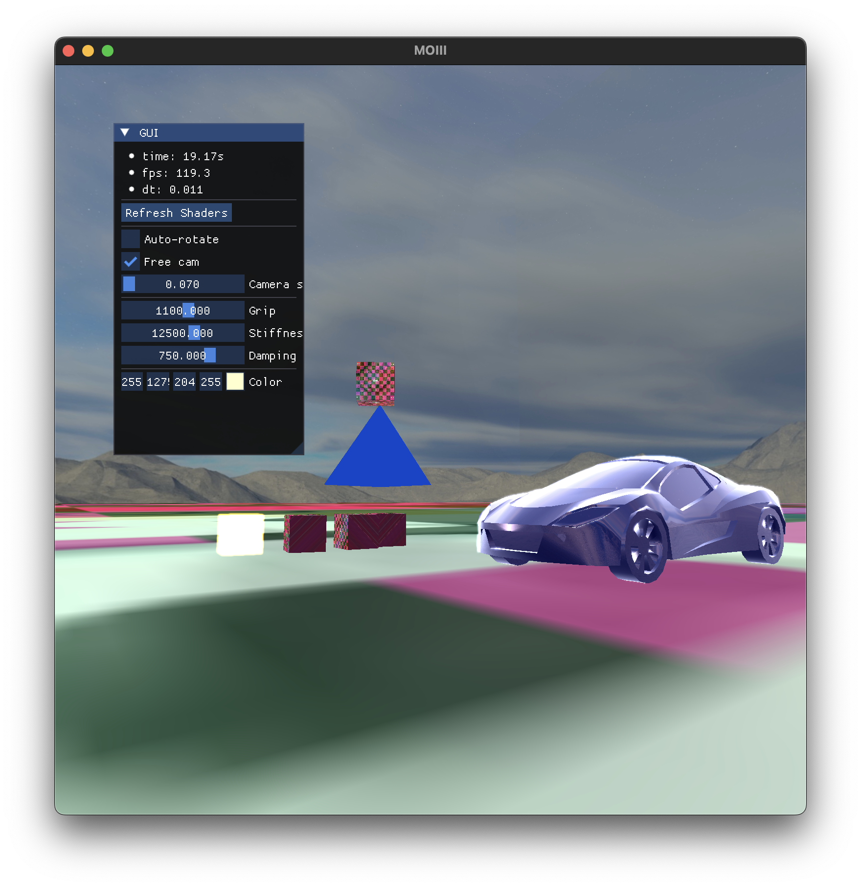

# Game2

# Project structure

```
Game2/
├── README.md                # Project overview and build instructions
├── CMakeLists.txt           # Main CMake configuration file
├── game/                    # Game-specific code and assets
│   └── include/             # Game-specific headers
│   ├── src/                 # Game implementation files (.cpp)
│   │   ├── main.cpp         # Entry point for the game
│   ├── assets/              # Game assets (textures, shaders, etc.)
│   │   ├── shader/          # Shader files (.vert / .frag)
│   │   └── texture/         # Texture / image files
├── engine/                  # Engine library
│   ├── include/             # Engine headers
│   │   ├── geom/            # Geometry classes (e.g., SphereGeometry, BoxGeometry)
│   │   ├── phys/            # Physics classes (e.g., RigidBody, Collider)
│   │   ├── component/       # Component headers (e.g., <Transform>)
│   │   └── util/            # Utility headers (e.g., Filesystem)
│   ├── src/                 # Engine implementation files (.cpp)
│   │   ├── component/       # GameObject components like <Transform>, etc.
│   │   ├── phys/            # Physics-related code
│   │   ├── gfx/             # Graphics-related code
│   │   └── util/            # Utility functions (e.g., Filesystem)
│   ├── lib/                 # Third-party libraries
│   │   ├── objload/         # OBJ model loader
│   │   ├── stb_image/       # Image loading library
│   └── CMakeLists.txt       # CMake configuration for the engine
└── build/                   # Build directory
```

# Installation and building 
External dependencies are installed with [Conan2](https://conan.io). 

## Release preset

- `conan install . --build=missing`

- `cd build`

- `cmake .. --preset conan-release`

- `cd Release`

- `make` - Note: add multithreading by adding `-j <number of threads>`

## Debug preset 

- `conan install . --build=missing --settings=build_type=Debug`

- `cd build`

- `cmake .. --preset conan-debug`

- `cd Debug`

- `make` - Note: add multithreading by adding `-j <number of threads>`

# Screenshots



